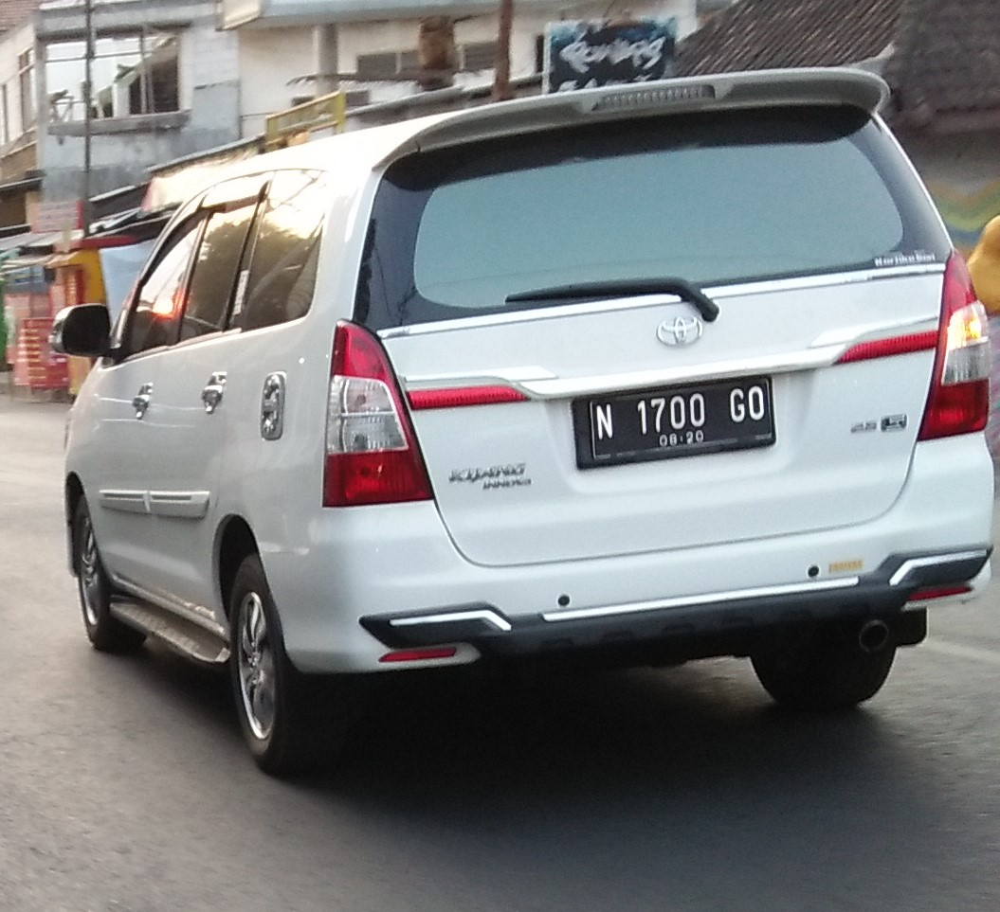

## [OSINT] Bandit
```
An Jieyab as informant took a photo of a vehicle, can you find the location?

The flag is name the location and date example TCP1P{Town, Coutry. Month Year}

Example: TCP1P{Yogyakarta, Indonesia. June 2010}
```

  
車の写真が渡される。exiftoolで見ても有益な情報がなかったので、唯一の情報源っぽいナンバープレートから探してみる。  

`n 1700 go number plate` で検索して一番上に出てくるサイトに同じ写真があった。  
source: [N 1700 GO, Toyota Kijang  (East Java (Batu, Malang, Pasuruan, Probolinggo)) License plate of Indonesia](https://platesmania.com/id/nomer24795105)  

`TCP1P{Malang, Indonesia. October 2019}`