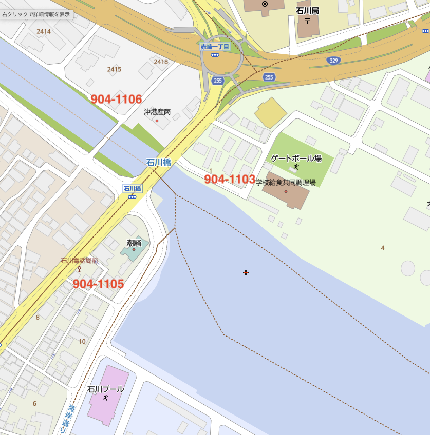

## [OSINT] That’s Him
```
Help Jieyab find Julient

The flag is country, prefecture, city, district/area, postal code

Exaample: TCP1P{Japan, Tokyo, Katsushika, Tateishi, 124-0012}

*Pro tips: Check the case sensitive. Make sure you have searched list of postal codes that area or the district
```

道路の写真と調査経緯？のまとまったPDFが渡される。  
写真からflagを取れたのでPDFはきちんと見ていない。  
  

日本っぽいし何か気合いで見えないかなと眺めていると、写真中央の建物に「ホテル潮騒」の文字を確認できた。  
ぼけぼけだったので日本語(またはアルファベット)じゃないと読めなかったかもしれない。  

  
↑かろうじて読める  

ホテル潮騒の所在地 `〒904-1105` を元に `TCP1P{Japan, Okinawa, Uruma, Ishikawashirahama, 904-1105}` で提出したところ弾かれた。  
`Uruma-shi` とか `Ishikawa Shirahama` とか色々バリエーション試してもダメ。  
ということできちんとストリートビューと[郵便番号区分け](https://www.mapion.co.jp/m2/26.431271294124464,127.83141551622523,18)を確認してみると、この辺りは郵便番号が三つ巴になっていた。  

  
↑写真付近の郵便番号区分け  
※mapionより引用, 赤字郵便番号を加筆  

写真ときちんと見比べて、`〒904-1103`の情報でflagを提出すると通った。  

`TCP1P{Japan, Okinawa, Uruma, Ishikawa Akasaki, 904-1103}`  
※ `Ishikawa Akasaki` か `Ishikawaakasaki` かどっちが通ったか忘れてしまった。どっちかが通った。  

余談:  
ホテル名を気合いで読んでしまったが、PDFから沖縄だということが分かりそうなので、手前の松屋の看板から攻めていくのが正攻法かな？と予想。  
松屋は沖縄に五店舗しかないらしいので、松屋付近の道路をストリートビューで見ていけば見つかるかもしれない。  